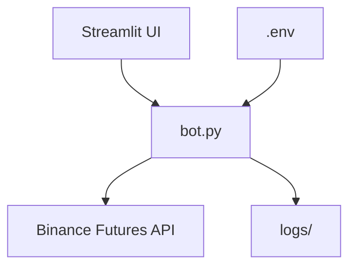

# 🤖 Binance Futures Trading Bot (Testnet)

A professional crypto trading bot for the **Binance Futures Testnet**, built using Python with an optional Streamlit-based frontend and full CLI interface.  
Easily place market, limit, and stop-limit orders, manage trades, cancel orders, view open positions, and monitor charts in real-time.


🚀 Live App:

👉 Try it on Streamlit - [https://binance-trading-bot-yourappname.streamlit.app](https://binance-trading-bot-u9ks9jjnitrztmwtauostz.streamlit.app/)
---
## 🚀 Features

### ⚙️ Core Trading Bot
- ✅ Market & Limit orders
- ✅ Stop-Limit order support
- ✅ Cancel open orders
- ✅ Order status checker
- ✅ Command-line interface using `Typer`
- ✅ Logging of all trades & errors

## 🧱 Project Structure

```bash
binance_trading_bot/
├── advanced_ui.py         # 🔘 Streamlit UI
├── bot.py                 # ⚙️ CLI interface
├── requirements.txt       # 📦 Required libraries
├── .env.example           # 🔐 Env template (safe to push)
├── .gitignore             # 🛡️ Ignores .env & __pycache__
├── README.md              # 📄 Project documentation
├── logs/                  # 📁 (Optional) log directory

```
## 🧠 Architecture


## 🔧 Tech Stack

### 💻 Languages & Frameworks
- **Python 3.11**
- **Streamlit** – for frontend UI
- **Pandas & NumPy** – for data handling
- **Matplotlib / Plotly** – for visualization (optional)
- **Binance API (Futures Testnet)** – for real-time trading and order management

### 🔗 APIs & External Services
- **Binance Futures Testnet**  
  REST endpoints used:
  - `/fapi/v1/account` – for account info
  - `/fapi/v1/order` – for placing and managing orders
  - WebSocket for live price updates (optional)

### 🛠️ Tools & Environment
- **Python Virtual Environment** (`venv`)
- **.env File** – for storing API keys securely
- **Git** – for version control
- **VS Code** – recommended for development

---
## 🏁 How to Run the Project

1. Clone the Repository
```bash
  git clone https://github.com/yourusername/binance_trading_bot.git
  cd binance_trading_bot
   ```
2.Create a Virtual Environment
  ```bash
  python -m venv venv
  venv\Scripts\activate  # Windows
  source venv/bin/activate  # Mac/Linux 
 ```
3.Install Dependencies
  ```bash
  pip install -r requirements.txt
  ```
4.Set Up Environment Variables
  ```bash
  Create a .env file in the root folder:
  BINANCE_API_KEY=your_key_here
  BINANCE_SECRET_KEY=your_secret_here
  BASE_URL=https://testnet.binancefuture.com
  ```
5.Run the Streamlit App
  ```bash
  streamlit run advance_ui.py
```

## 📸 Screenshots

### 🧾 Place Order UI  


### 📊 Live Price Chart  


### 📂 Open Orders Display 

